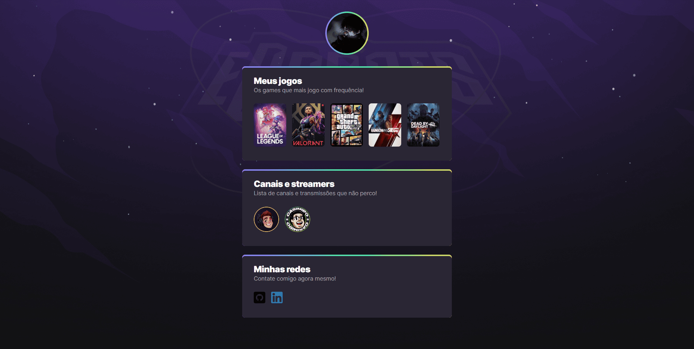

# NLW-eSports
Projeto desenvolvido com base no evento Next Level Week da Rocketseat .

## 🚀 Tecnologias

Esse projeto foi desenvolvido com as seguintes tecnologias:
- HTML
- CSS
- Git e Github

## 📚 Bibliotecas:

Esse projeto foi utilizado fonte externa através do:
- [Google Fonts](https://fonts.google.com/)

## 💻 Projeto

> **Objetivo:** Criar um encurtador com links de jogos, streamers, redes sociais.
